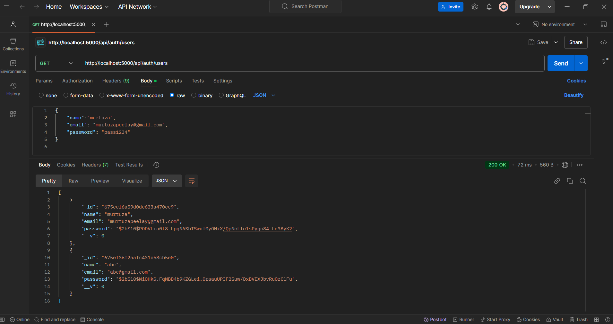
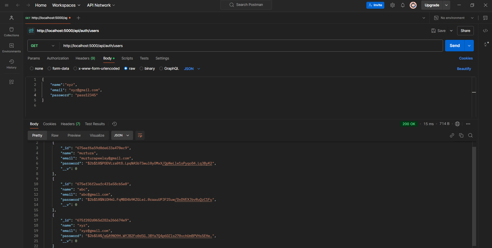

# Authentication System

This repository contains an authentication system built to handle user registration, login, and session management. The project is designed to be secure, scalable, and easy to integrate into existing applications.

---

## Features

- User registration with email and password
- Secure user authentication using hashed passwords
- Session management for logged-in users
- Middleware to protect private routes
- User-friendly error handling and validation

---

## Screenshots

### Signup Screen 

## Getting all signUp Users



## Getting all signUp Users with added one 


---

## Technologies Used

- **Backend**: Node.js, Express.js
- **Database**: MongoDB
- **Authentication**: JWT (JSON Web Tokens)
- **Security**: Bcrypt for password hashing

---

## Installation

1. **Clone the Repository**:
   ```bash
   git clone https://github.com/PeelayMurtuza/Authentication.git
   cd Authentication
